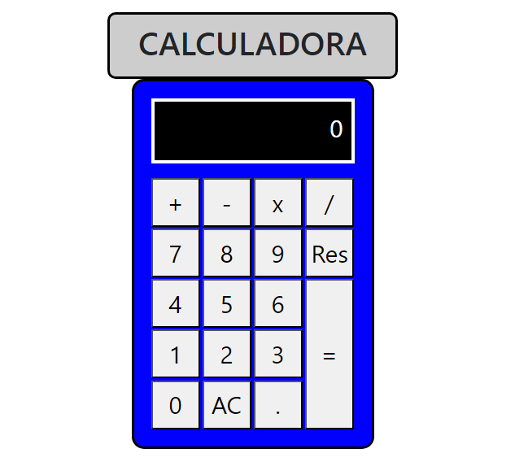

# Calculadora Basica

Este projeto é um projeto para aprimorar minha prática em programação utilizando HTML, CSS e Javascript, através do desenvolvimento e aprimoramento de uma calculadora simples. 

### Tecnologias Utilizadas

* HTML
* CSS
* JAVASCRIPT

### Como executar o projeto

Para executar o projeto, siga os seguintes passos:

1. Clone o repositório do GitHub:
2. Abra index.html.

Obs:
    Sei que é um projeto simples, porém, pretendo usar esse projeto para praticar programação, e pretendo desenvolver outros projetos maiores.